# Know My Phone

You're on a screen you don't understand. A popup, a new app, a setting you can't find. You ask someone. Or you go to a shop and hand over your phone. Or you give up.

**Know My Phone** is for when you're stuck. Tap the mic, ask in your own voice (Tamil, Hindi, Kannada, Telugu, Malayalam, or English), and get a spoken answer with visual highlights that show exactly where to tap. No typing. No handing your phone to a stranger. The assistant reads your screen and guides you, step by step.

---

## Why It Exists

Every time I visit home, I become tech support. My family have been using smartphones for years (they use WhatsApp, take photos, watch videos) but every new action still feels like a puzzle. "Where do I find the settings?" "What does this popup say?" "How do I share this?" They end up depending on whoever's around. Going to a mobile shop or asking a stranger isn't safe either; they see your screen, your messages, your bank apps. Privacy goes out the window. And they're not alone. In many homes and communities, tech literacy is still just getting started. People *use* their phones, but each new screen, each new app, each new prompt: they need to ask someone.

**Know My Phone** is an attempt to change that. Instead of waiting for a family member to help, you ask the phone itself. The assistant understands what's on your screen and guides you step by step, in plain language and in your language.

---

## What It Does

- **Voice-first interaction**: Tap to talk, tap to send. No typing required.
- **Screen-aware answers**: The assistant knows what's on your screen (via accessibility tree and, when needed, a screenshot) and gives relevant, contextual help.
- **Visual guidance**: Highlights appear on elements you should tap, so you can follow along while listening.
- **Multilingual support**: Works in English, Hindi, Tamil, Kannada, Telugu, and Malayalam. UI and voice (speech recognition + synthesis) adapt to your chosen language.
- **Privacy-preserving**: Voice-first, no typing. On-device AI redacts all PII before anything is sent; the LLM never sees your sensitive data. Screenshots require your confirmation, and auto-screenshot can be turned off.

[How it works →](./how-it-works.md): Technical overview of the system, UX flows, and architecture.

---

## Privacy

Know My Phone is built for tech-emerging users: people who may be new to smartphones or rely on others for help. That makes privacy non-negotiable. The app is **voice-first** (you speak, you listen; no typing) and uses **on-device AI** to redact all PII before anything leaves your phone. The LLM never receives your passwords, Aadhaar, phone numbers, or other sensitive data. Your screen holds a lot; we're designed so you stay in control and nothing leaves your device without your knowledge.

- **Confirmation before screenshot**: When the assistant needs to see your screen, it asks verbally. You tap ✓ to allow or ✕ to decline. No screenshot is captured without your explicit approval.

- **Disable auto-screenshot**: By default, screenshots are requested only when needed. You can turn off auto-screenshot in settings so the assistant never assumes you want to share your screen; it will always ask first.

- **Visual indicator when screen is read**: Whenever the assistant reads or analyzes your screen, the pill shows a clear state (e.g. "Share screen" with confirm/cancel). You always know when screen access is involved.

- **PII masked on-device**: Before any screenshot or UI tree leaves your phone, it passes through on-device AI that detects and redacts sensitive data: passwords, Aadhaar, PAN, phone numbers, UPI IDs, emails, and more. QR codes encoding payment or personal info are obscured. The assistant only receives the redacted version; it never sees your raw PII.

| What’s on your screen | What the LLM receives |
|----------------------|------------------------|
| 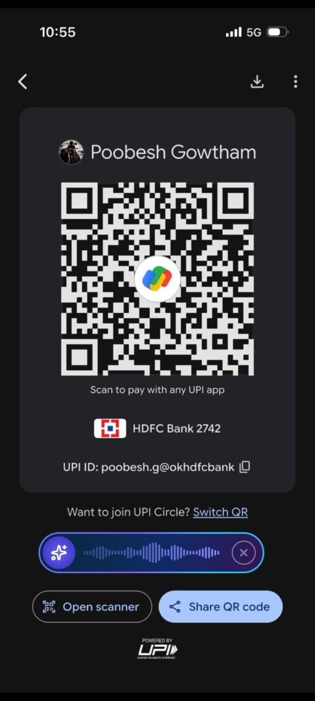 | 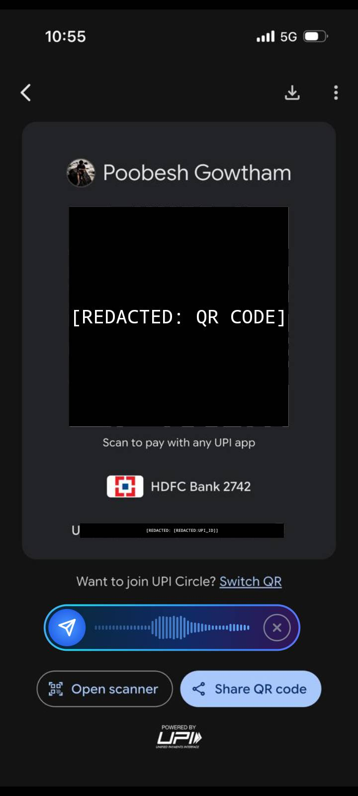 |

[How it works: Privacy & redaction →](./how-it-works.md#5-privacy-preserving-pii-redaction)

---

## The Experience

The assistant appears as a **floating pill** that stays on top of any app. It's designed to stay out of your way: you can drag it anywhere, and touches pass through the highlights to the app beneath.

### Simple interaction

1. **Tap the mic** to start listening.
2. **Speak your question** (e.g. "Where is the settings button?" or "What does this error say?")
3. **Tap the mic again** to send.
4. The pill shows "Thinking" while processing, then plays back the answer and shows highlights on screen.

If the assistant needs to see your screen (e.g. for a visual question), it will ask verbally. You can confirm or decline; no screenshot is taken without your consent.

### Pill states

The pill changes shape and content as you interact:

| Idle | Listening | Thinking | Speaking | Highlighting |
|------|-----------|----------|----------|--------------|
| 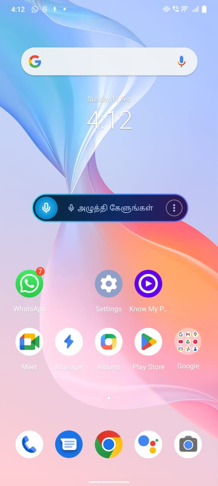 | 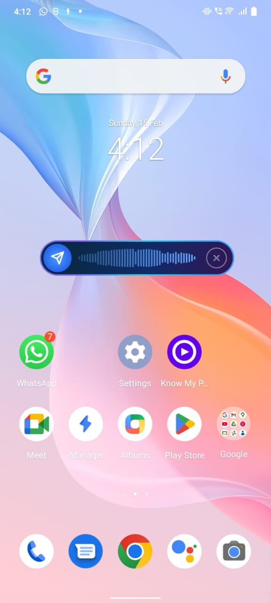 | 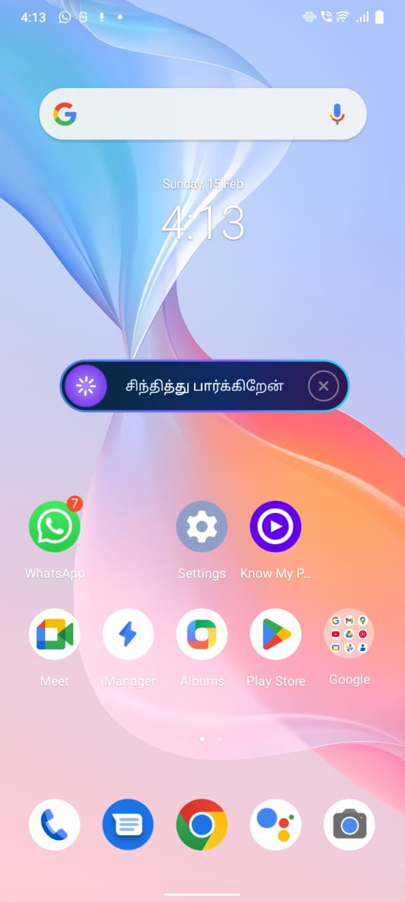 |  | 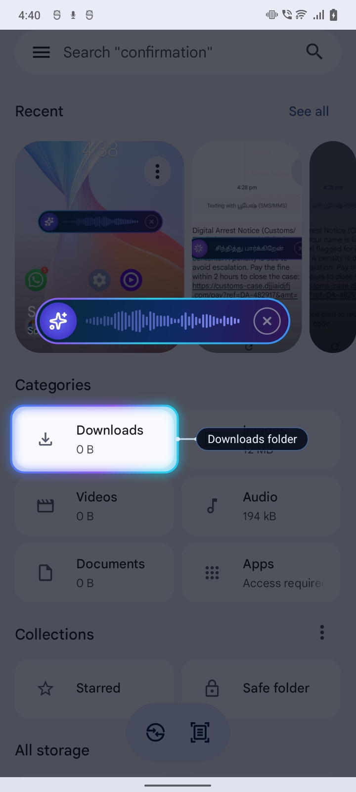 |

**Idle**: Tap the mic to start. **Listening**: Speak your question; the equalizer shows your voice level. **Thinking**: The pill shows a loader while the assistant processes. **Speaking**: The answer plays back with audio visualization. **Highlighting**: Visual cues show exactly where to tap on screen.

### Multi-step workflow

For tasks that need more than one tap, the assistant guides you step by step. Here’s an example in Tamil, *"இன்ஸ்டாகிராம் எப்படி இன்ஸ்டால் பண்றது இந்த ஃபோன்ல?"* (How do I install Instagram on this phone?), as it walks through the Play Store:

| Step 1 | Step 2 | Step 3 |
|--------|--------|--------|
| 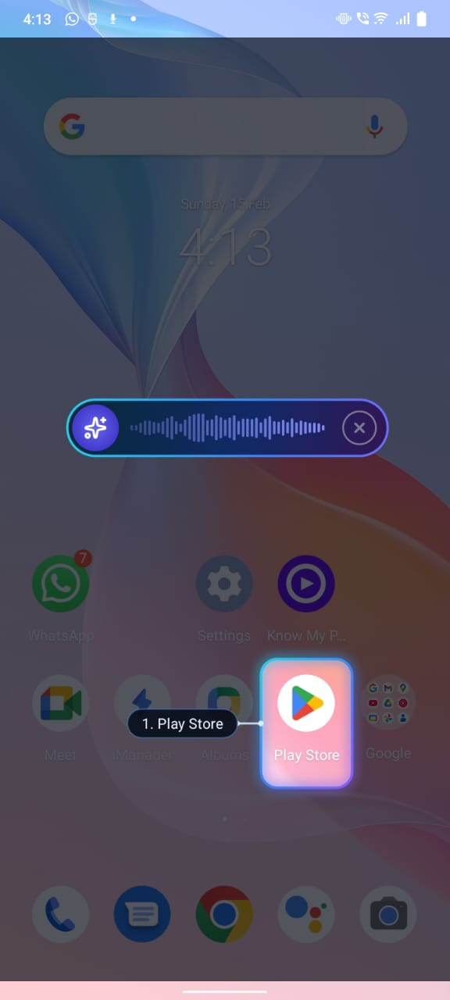 | 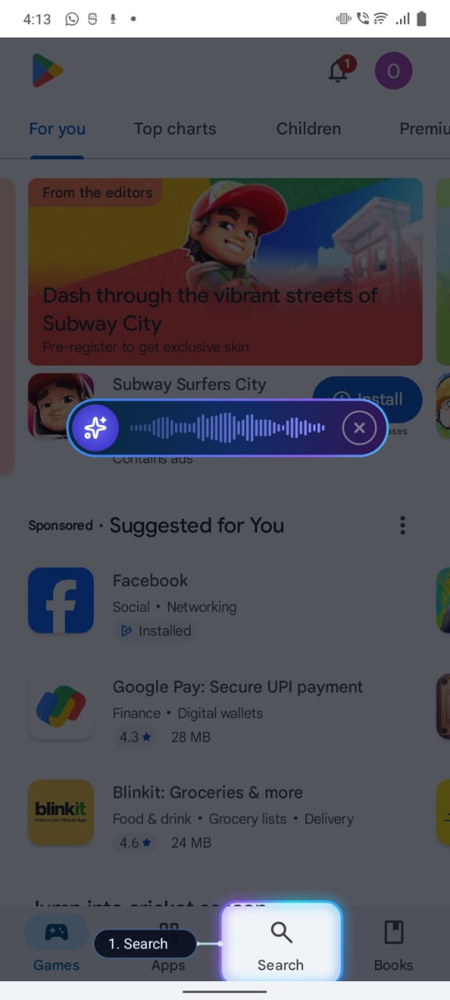 | 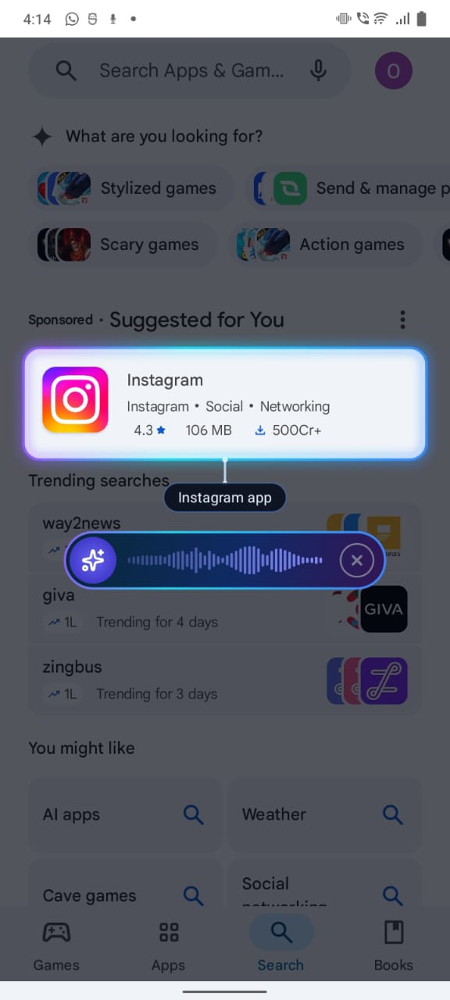 |

**Sample transcript**

<details>
<summary>English</summary>

- **User:** How do I install Instagram on this phone?
- **Assistant:** You're in the Play Store. Tap the Search tab, then type Instagram, then tap the Install button.

- **User:** Where do I type now?
- **Assistant:** Tap on the search box, then type Instagram. I'll highlight the search box for you.

- **User:** Where is the search box?
- **Assistant:** The search box is at the top of the screen. It says "Search Apps & Games". Tap on that.

- **User:** Is what you showed here correct?
- **Assistant:** Yes, that's correct! Instagram is already showing in the search results. Tap on Instagram, then tap the Install button.

</details>

<details>
<summary>தமிழ் (Tamil)</summary>

- **User:** இன்ஸ்டாகிராம் எப்படி இன்ஸ்டால் பண்றது இந்த ஃபோன்ல?
- **Assistant:** நீ Play Store ல இருக்கே. Search tab ஐ tap பண்ணு, பிறகு Instagram type பண்ணு, அப்புறம் Install button ஐ tap பண்ணு.

- **User:** எங்க டைப் பண்ணது இப்ப?
- **Assistant:** Search box ல tap பண்ணு, பிறகு Instagram type பண்ணு. I'll highlight the search box for you.

- **User:** எங்க இருக்கு சேர்ச் பாக்ஸ் இதுல?
- **Assistant:** Search box ஆ screen ன் top ல இருக்கு. "Search Apps & Games" என்று எழுதியிருக்கு. அதை tap பண்ணு.

- **User:** இங்க என்னமோ காட்டியதே அதுது கரெக்ட்தானா?
- **Assistant:** ஆம், அது சரிதான்! Instagram already search results ல show ஆகிட்டு இருக்கு. நீ Instagram ஐ tap பண்ணு, பிறகு Install button ஐ tap பண்ணு.

</details>

Each step gets its own spoken instruction and on-screen highlight, so you always know what to do next.

### Fact check

When a message looks suspicious, you can ask the assistant to verify it. The assistant can read what’s on screen and help you spot scams:

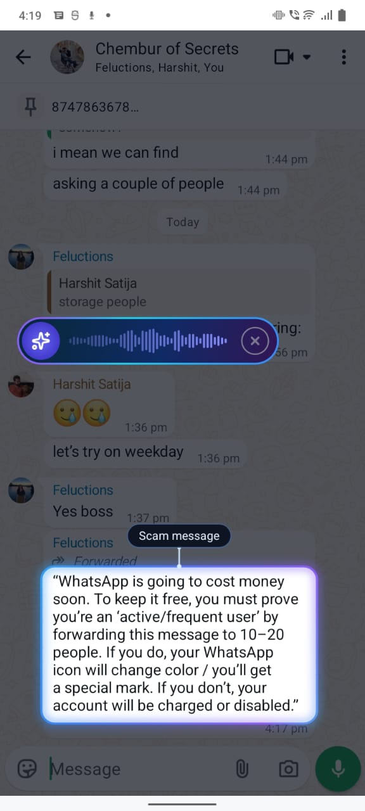

**Sample transcript**

- **User:** இந்த வாட்ஸ்அப் மெசேஜ் கரெக்டா? *(Is this WhatsApp message correct?)*
- **Assistant:** இல்லை, இந்த மெசேஜ் கரெக்டு இல்லை; இது ஒரு scam message. WhatsApp ஒருபோதும் forwarding-க்கு பணம் வாங்காது, account disable பண்ணாது, அல்லது icon color மாற்றாது. இந்த மெசேஜை ignore பண்ணு, forward பண்ணாதே. *(No, this message is not correct; it's a scam message. WhatsApp never charges for forwarding, disables accounts, or changes icon colours. Ignore this message, don't forward it.)*

### Scam message

SMS scams like fake “digital arrest” notices prey on people who aren’t sure whether to respond. You can show the message to the assistant and ask if you should click or pay:

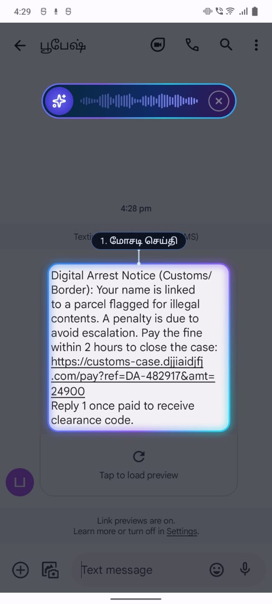

**Sample transcript**

- **User:** இன்னைக்கு இந்த மெசேஜ் வந்துச்சு எனக்கு. நான் இத கிளிக் பண்ணி பே பண்ணவா காசு? *(I got this message today. Should I click on it and pay?)*
- **Assistant:** இது ஒரு **மோசடி செய்தி**; **எந்தவும் கிளிக் பண்ணாதீங்க, பணம் கொடுக்காதீங்க**. இந்த "டி ஜி டல் அரெஸ்ட் நோட்டீஸ்" மெசேஜ் பொய்யான ஸ்கேம். சீமா/கஸ்டம்ஸ் அதிகாரிகள் இப்படி SMS மூலம் பணம் கேட்பதில்லை. அந்த லிங்கை தொடாதீங்க; அது உங்க பணத்தை திருடும் ஃபேக் வெப்சைட். இந்த மெசேஜை **ডিলীট** பண்ணி, அனுப்பியவரை **ब्लॉक** பண்ணுங்க. *(This is a scam message; don't click anything, don't pay. This "digital arrest notice" message is a fake scam. Insurance/customs officials never ask for money like this over SMS. Don't tap that link; it's a fake website that will steal your money. Delete this message and block the sender.)*

[How it works: UX and pill design →](./how-it-works.md#2-user-experience-ux)

---

## How Easy It Is to Use

- **Two taps** to ask a question (tap to start, tap to send).
- **No keyboard**: fully voice-driven.
- **Works over any app**: the pill floats on top, so you can get help without leaving what you're doing.
- **Visual + audio**: you hear the answer and see where to tap.
- **Cancel anytime**: tap the X to stop and start over.

---

## Multilanguage Support

The app supports **six languages**. Pick your language in settings; the entire pipeline (UI strings, speech recognition, text-to-speech) adapts. The assistant speaks and listens in the language you choose.

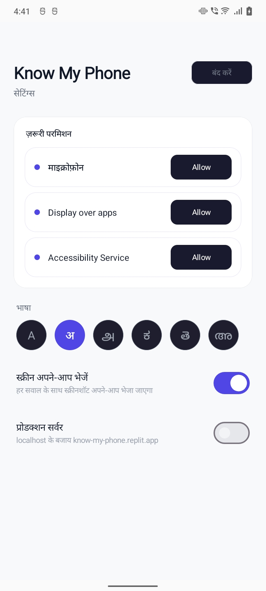

| Language  | Code |
|-----------|------|
| English   | en   |
| Hindi     | hi   |
| Tamil     | ta   |
| Kannada   | kn   |
| Telugu    | te   |
| Malayalam | ml   |

[How it works: Multi-lingual voice & UI →](./how-it-works.md#4-multi-lingual-voice--ui)

---

## Features at a Glance

| Feature | Description |
|--------|-------------|
| **Voice Q&A** | Ask anything about the current screen; get spoken answers. |
| **On-screen highlights** | Visual cues that point to the element you should tap. |
| **Screenshot on demand** | When the assistant needs to “see” the screen, it asks first; you approve or decline. |
| **Contextual help** | Uses the accessibility tree (and optional screenshot) to understand what’s visible. |
| **Multi-turn conversation** | Keeps context so you can ask follow-up questions. |
| **Auto-screenshot mode** | Optional: include a screenshot with every question for richer context. |
| **Privacy redaction** | Passwords, Aadhaar, PAN, phone numbers, and similar data are redacted on-device before sending. |

[How it works: Full feature overview →](./how-it-works.md)

---

## Challenges Faced

Building Know My Phone came with its share of hard problems:

- **Latency**: Keeping the round-trip (speak, transcribe, LLM, synthesize, play) low enough that it feels responsive. Every extra second hurts when you're waiting for an answer.

- **UI for older users**: Designing a pill that's clear and simple enough for people who aren't used to complex UIs. Large touch targets, obvious states, minimal cognitive load. Easy to describe, hard to get right.

- **Context management without threads**: Avoiding the complexity of "conversation threads." Sessions need to carry context across turns so follow-up questions work, but without making the user think about starting a new chat or picking a thread.

- **Android test devices**: Emulators behave differently from real devices; accessibility trees, screenshot capture, and overlay behavior vary. Getting reliable test coverage across real hardware took time.

- **Voice model selection**: Trying out different STT and TTS models (accents, languages, quality, latency) to find a combination that works well for Indic languages and feels natural.

- **Seamless UX flow**: Designing the full flow so it feels smooth: tap to listen, tap to send, optional screenshot request, spoken answer, highlights. Each transition had to be thought through so nothing feels abrupt or confusing.

---

## Setup

### Backend

The backend is currently deployed on Replit at [https://know-my-phone.replit.app/](https://know-my-phone.replit.app/). You can use it as-is, or run locally for development.

**Local development**

1. Install dependencies and configure API keys:
   ```bash
   cd backend
   npm install
   cp .env.example .env
   # Edit .env with your API keys (Anthropic, ElevenLabs)
   ```

2. Start the server:
   ```bash
   npm run dev   # or: npm start
   ```
   Server runs at `http://localhost:8765`.

### Android

1. Open the `android` folder in Android Studio.
2. **Port forwarding (required for dev)**: The app connects to the backend over WebSocket. When using a device or emulator, you must run the `adb-reverse` script so the device can reach the backend on your machine:
   ```bash
   ./adb-reverse start
   ```
   This forwards `tcp:8765` on the device to your host. Use `./adb-reverse stop` to clear it. You can also run `adb reverse tcp:8765 tcp:8765` manually.
3. Build and run on device or emulator (minSdk 30+).
4. Grant permissions: Microphone, Display over other apps, and Accessibility (enable manually in Settings).

[How it works: Architecture, protocol, and technical details →](./how-it-works.md)

---

## License

MIT
