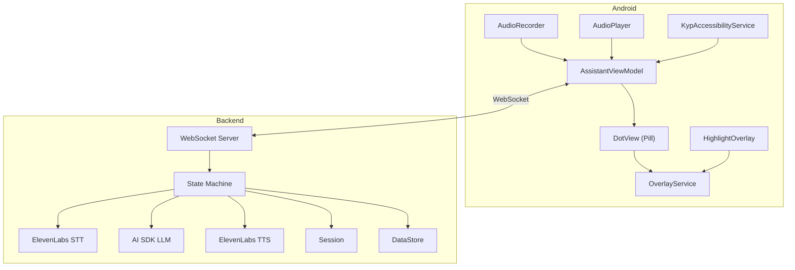
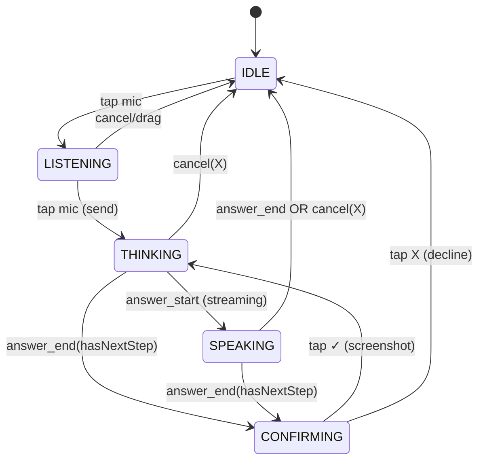
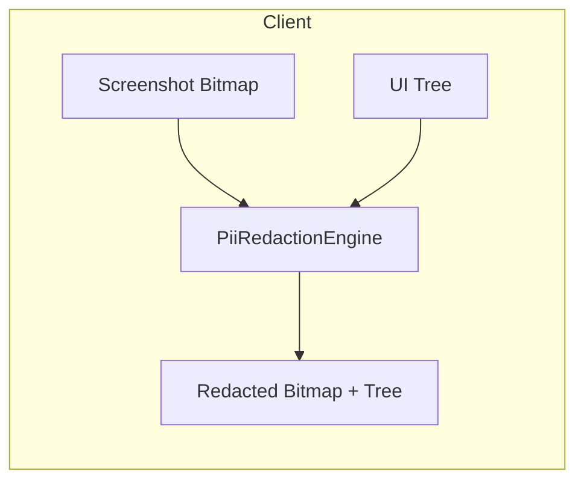
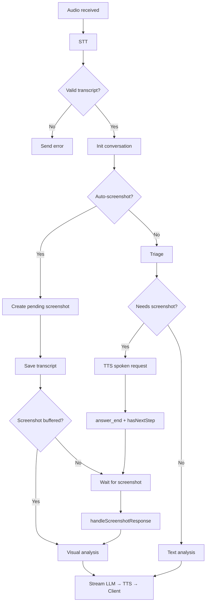

# How Know My Phone Works

A technical overview of the Android "screen support" voice assistant — how it orchestrates voice, vision, and UI to help users understand what's on their screen.

---

## Table of Contents

1. [System Overview](#1-system-overview)
2. [User Experience (UX)](#2-user-experience-ux)
3. [Pill Design & State Flows](#3-pill-design--state-flows)
4. [Multi-lingual Voice & UI](#4-multi-lingual-voice--ui)
5. [Privacy-Preserving PII Redaction](#5-privacy-preserving-pii-redaction)
6. [Context & Conversation Management](#6-context--conversation-management)
7. [Backend Pipeline & State Machine](#7-backend-pipeline--state-machine)
8. [Debug UI](#8-debug-ui)
9. [WebSocket Protocol](#9-websocket-protocol)
10. [Reliability & Cancellation](#10-reliability--cancellation)

---

## 1. System Overview

Know My Phone runs a floating pill overlay on Android. Users tap the mic to start listening and tap again to send their question to the server; the backend transcribes speech, triages whether a screenshot is needed, runs an LLM (text-only or multimodal), and streams spoken answers with optional on-screen highlights.



On the Android side, the `OverlayService` hosts the pill (`DotView`) and the `HighlightOverlay`. The `KypAccessibilityService` collects the UI tree and captures screenshots when needed. The `AssistantViewModel` coordinates state and WebSocket communication across all these components.

On the backend, an Express + WebSocket server receives audio and screenshots. The [state machine](backend/src/stateMachine.ts) orchestrates the full pipeline: STT → triage → (optional screenshot) → LLM → TTS. [Session](backend/src/session.ts) and [dataStore](backend/src/dataStore.ts) handle conversation history and turn persistence.

---

## 2. User Experience (UX)

### Core Interaction

The interaction is tap-based: **tap the mic to start listening**, then **tap again to send** your question to the server. There is no press-and-hold.

When idle, the pill shows a localized prompt such as "Tap [mic] to ask", with a mic icon on the left and a menu (⋯) on the right. A tap on the mic icon starts recording; the pill morphs into a wider form with dynamic equalizer bars that reflect your voice level. When you are done speaking, you tap the mic again to send; the audio is transmitted to the backend and the pill shows "Thinking" with a rotating loader. The spoken answer streams back; the equalizer reflects playback level and highlights may appear on screen during or after speech. When the LLM decides it needs to see your screen, it asks verbally via TTS; the pill switches to a confirm mode with ✓ and ✕. Tap ✓ to capture and share a screenshot, or ✕ to decline and receive a text-only fallback answer.

### Design Principles

The pill is designed to stay out of your way. It is draggable so you can reposition it, and the highlight overlay uses `FLAG_NOT_TOUCHABLE` so touches pass through to the underlying app. You can interrupt at any time: tapping the X button during THINKING or SPEAKING cancels and returns to IDLE; tapping the mic again immediately starts a new recording. Connection state is always visible via the pill outline—white when connected, red when disconnected, yellow pulsing when reconnecting. Errors appear as a toast overlay near the pill and auto-dismiss after about three seconds.

---

## 3. Pill Design & State Flows

The pill is a compact floating control that adapts its width and content to the current state. It has three touch zones: a left circle (mic or ✓), a center strip for text or the equalizer, and a right circle (menu dots or X). The pill uses a dark gradient background and an outline that can be static or animated depending on whether the system is actively processing or streaming.

| State | Left icon | Center content | Right zone | Outline |
|-------|----------|----------------|------------|---------|
| **IDLE** | Mic | "Tap [mic] to ask" | Menu (⋯) | Static |
| **LISTENING** | Mic (active) | Dynamic EQ | X | Animated gradient |
| **THINKING** | Rotating loader | "Thinking" (sheen) | X | Animated gradient |
| **SPEAKING** | Sparkles | Dynamic EQ | X | Animated gradient |
| **CONFIRMING** | ✓ | Label (e.g., "Share screen") | X | Static |

### State Diagram



### Alternative Flow (Triage requests screenshot before LLM)

When triage decides a screenshot is needed, the backend first TTS-es a spoken request and sends `answer_end` with `hasNextStep: true`. The client shows CONFIRMING immediately (no LLM analysis yet). The user taps ✓ to capture and send the screenshot; the backend runs visual analysis and streams the answer as normal.

### Pill Actions

| Zone | Action | Effect |
|------|--------|--------|
| Left circle (mic) | Tap | Start listening (IDLE) or send (LISTENING) |
| Left circle (✓) | Tap | Confirm screenshot capture |
| Right circle | Tap | IDLE → menu / else → cancel |
| Center | — | No touch target |

---

## 4. Multi-lingual Voice & UI

The app supports English, Hindi, Tamil, Kannada, Telugu, and Malayalam. UI strings are defined in [`languages.json`](android/app/src/main/assets/languages.json). Each language has a full set of pill strings (`tapPrefix`, `tapSuffix`, `thinking`, `shareScreen`, `idlePrompt` with optional `{mic}` placeholder, `closeApp`, `showOpenApp`) and app strings for settings, permissions, and errors. The `LanguageManager` loads this config at startup; the pill receives localized text via `setLanguageStrings()`. Indic languages use a slightly smaller text size for better readability on the pill.

The voice pipeline is language-aware end-to-end. For STT, ElevenLabs Scribe receives a `language_code` (e.g. `hin`, `tam`, `kan`, `tel`, `mal`) so transcription respects the chosen language. For TTS, the backend resolves a per-language voice via `ELEVENLABS_VOICE_ID_*` env vars and an optional per-language streaming model. The client sends `set_language` when the user changes language; the backend stores `session.languageCode` and passes it to STT, TTS, and LLM prompts so the entire pipeline stays consistent.

---

## 5. Privacy-Preserving PII Redaction

All sensitive data is redacted on-device before anything leaves the phone. Screenshots and UI trees are passed through the `PiiRedactionEngine`; only sanitized data is sent to the backend. The LLM never sees raw PII.



Redaction runs in three layers. Layer 0 uses metadata heuristics: password fields, phone-number input types, and nodes whose resource IDs contain keywords like `aadhaar`, `pan`, or `password` are redacted in full as `[REDACTED:SENSITIVE_FIELD]`. Layer 1 runs regex patterns over the `text` and `contentDescription` of each UI node. It detects email, credit card (validated with Luhn), Aadhaar (Verhoeff checksum), PAN, UPI ID (allowlisted handles), Indian phone numbers, IFSC codes, vehicle registration, GSTIN, IP addresses, and URLs containing auth tokens. Overlapping matches are resolved; each match is replaced with a typed placeholder such as `[REDACTED:AADHAAR]`. Layer 2 handles visual content that never appears in the accessibility tree: faces (ML Kit face detection, gray fill), QR codes that encode UPI or other PII (black fill), and OCR-derived text blocks that match PII patterns but fall outside nodes already redacted by Layer 1. All three layers run in parallel where possible; the final bitmap and UI tree are composited and sent.

The backend receives `redactions` and `visualRedactions` metadata alongside the redacted content. The LLM knows which regions are obscured and can still reason about screen structure (e.g. "there is a field labeled [REDACTED:AADHAAR] here"). Prompts instruct it to treat placeholders as intentionally obscured and not to infer the original values.

---

## 6. Context & Conversation Management

The backend distinguishes between a **session** (a WebSocket connection, identified by the client-provided `sessionId` in the `hello` message) and a **conversation** (a logical chat). A session holds the current `conversationId`, `conversationHistory`, `languageCode`, `autoScreenshot`, and `deviceInfo`. A conversation is identified by a timestamp-based ID (e.g. `2025-02-15T12-34-56`) and can span multiple turns. A single session can produce many conversations over time, especially when inactivity resets occur.

After 30 minutes without any message, the session starts a new conversation automatically: a new `conversationId` is generated, history is cleared, and the turn counter resets. This prevents long-idle chats from accumulating stale context and keeps token usage bounded.

For the LLM, the last 10 messages (roughly five turns) are kept. Each message is stored as `[user/assistant, content, timestamp]`; user messages are prefixed with a relative time (e.g. `[2 min ago]`) so the model has recency context without relying on absolute timestamps.

Each turn is persisted to disk by the [`dataStore`](backend/src/dataStore.ts): transcript, audio file paths, screenshot, UI tree, triage result, and timing breakdown. This powers the [Debug UI](#8-debug-ui) and provides robustness across server restarts.

---

## 7. Backend Pipeline & State Machine

### High-Level Flow



The main entry point is `handleAudioReceived`: it runs STT, then either buffers an auto-screenshot (if enabled) or runs triage to decide if a screenshot is needed. If no screenshot is required, it proceeds to text-only analysis; otherwise it waits for the client. When a screenshot arrives, `handleScreenshotResponse` resolves the pending request and runs visual analysis. In auto-screenshot mode, the screenshot can arrive before STT completes; in that case it is buffered and processed as soon as the transcript is ready. If the user declines with `screenshot_declined`, the backend clears the pending request and falls back to text-only analysis so the user still gets an answer.

Each session has an `AbortController`. Sending new audio or an explicit `cancel` message aborts any in-flight STT, LLM, or TTS work; the server responds with `cancelled` so the client can reset cleanly.

---

## 8. Debug UI

The backend serves a single-page debug UI at `http://localhost:PORT/` (the same origin as the API). It is a conversation viewer for all data persisted to disk—useful during development and demos.

The layout has a sidebar and a main area. The sidebar includes a client dropdown (populated from clients that have stored conversations), a list of conversations for the selected client, and a live indicator. The main area shows turn cards: each turn can be expanded or collapsed and displays the full pipeline breakdown—when audio was received, when STT completed, when triage ran, when a screenshot was requested and received, when the LLM ran, and when TTS finished. You can see the user transcript, play back the input and output audio, view the screenshot and UI tree side by side, and inspect the highlights that were sent to the client. The URL uses hash-based routing (`#client=X&conv=Y`) so you can share links to specific conversations.

The UI fetches data from the REST API: `GET /api/clients`, `GET /api/clients/:clientId/conversations`, `GET /api/clients/:clientId/conversations/:convId` for the full conversation JSON, and `GET /api/data/:clientId/:convId/:type/:filename` for binary assets (screenshots, audio, UI trees). The conversation list is polled so new data appears as turns complete.

---

## 9. WebSocket Protocol

### Client → Server

| Type | Payload |
|------|---------|
| `hello` | `{ sessionId, clientId?, deviceInfo? }` |
| `set_language` | `{ languageCode }` |
| `set_auto_screenshot` | `{ enabled }` |
| `audio_data` | `{ format: "wav", sampleRate: 16000 }` then binary WAV |
| `screenshot_response` | `{ screenshot, uiTree, redacted?, redactions?, visualRedactions? }` |
| `screenshot_declined` | `{}` |
| `cancel` | `{}` |

### Server → Client

| Type | Payload |
|------|---------|
| `transcript` | `{ text }` |
| `need_screenshot` | `{ reason }` |
| `answer_start` | — |
| *(binary)* | PCM chunks (24kHz, 16-bit) |
| `answer_end` | `{ text, highlights, hasNextStep?, confirmLabel? }` |
| `highlights` | `{ highlights }` (streamed during speech) |
| `error` | `{ message }` |
| `cancelled` | `{}` |

### Highlight Format

```json
{ "elementId": "n_23a9", "label": "Tap here", "bounds": { "left": 80, "top": 920, "right": 500, "bottom": 980 } }
```

---

## 10. Reliability & Cancellation

The Android client uses exponential backoff when the WebSocket disconnects: it retries after 1s, 2s, 4s, and so on, capped at 30s. Backoff resets as soon as a connection succeeds. The pill outline reflects the current state: white when connected, red when disconnected, yellow pulsing when reconnecting.

API calls have explicit timeouts: STT 30s, triage 15s, LLM 30s, TTS 15s. Pending screenshot requests time out after 60s (or 30s for auto-screenshot mode); if the client does not respond in time, the backend sends an error and cleans up.

On SIGTERM or SIGINT, the server closes all WebSocket connections with code 1001 ("going away") and waits for them to shut down cleanly. If connections do not close within 5 seconds, the process force-exits.
